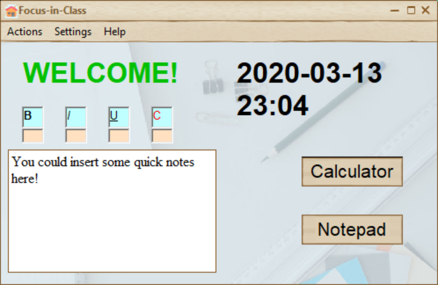
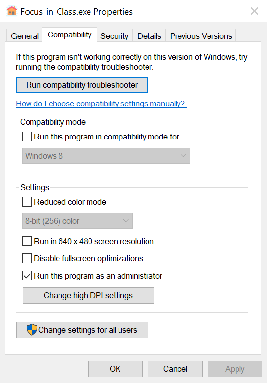

# Focus-in-Class-v2

<p align="center"></p>
  
# What is it?
By name, this is an application that helps students focus in class. Quite simple, right? So basically I developed this application inspired from this situation:

You are sitting inside a classroom with your other peers, having classes, and you prefer to use a computer to take notes. BUT the Catch-22 situation in reality is that this high tech stuff distracts you, and you'll have to use it to open digital documents required...

So, what's the solution? I eventually decided to program this **Focus-in-Class** application to prevent distraction.

# Installation

## Prerequisite

Make sure you have **richtx32.ocx** and **comdlg32.ocx** component in your computer. If your computer does not have them, download the files in the repository.

1. For Windows 32-bit systems, extract the file to **C:\Windows\System32**. Run ```regsvr32.exe C:\system32\RICHTX32.ocx``` and ```regsvr32.exe C:\system32\comdlg32.ocx```.

2. For Windows 64-bit systems, extract the file to **C:\Windows\SysWOW64**. Run ```C:\Windows\SysWOW64\regsvr32 C:\Windows\SysWOW64\RICHTX32.ocx``` and ```C:\Windows\SysWOW64\regsvr32 C:\Windows\SysWOW64\comdlg32.ocx```.

The following messages like this would appear: **DllRegisterServer in C:\Windows\system32\RICHTX32.ocx succeeded**, meaning that the component is installed.

## Default Method

1. Download the **.msi** file and run it. Follow the installation instructions.
2. IMPORTANT: The application needs to run as an administrator. To avoid right click each time, go to the installation folder in **C:\Program Files (x86)\Focus-in-Class**.
3.  Right click the executable file and select properties. In the compatibility section, choose "Run this program as an administrator" option.



## Portable Method

Download the Portable folder, and the executable file would be included. Change the administrator option similarly.

# Usage

## Interface

There are four languages supported by this program: English, French, Chinese (Simplified), and Chinese (Traditional). The system will recognize automatically according to your preference.

---

The main interface is always on top of other applications. There is a quick notes section, where you could take temporary notes. You could edit the texts in bold, italic, underlined, and red via the blue buttons. The reverse buttons are shown in pink. Remember to export the notes via the **Actions->Export Quick Notes** menu. You could also import previous notes via the **Actions->Import Quick Notes** menu.

If you are trying to take more complicated notes, click the **Notepad** button. This will open the Notepad application in the system.

You could also use the calculator in the system by clicking the **Calculator** button.

## Force Mode

This is the most important part of this application. You could enter it through **Actions** or **Settings** on the menu. It has the following features.

- locking the windows keys such as **Ctrl+Shift+Esc** and **Win+Tab** (you know the reason😳).
- forcing into the full screen mode (cannot resize or minimize)
- hiding taskbar
- not accessing other applications

**REMEMBER: DO NOT MINIMIZE WHEN USING NOTEPAD OR CALCULATOR DURING FORCE MODE**

## Starting Class

Set the duration first. Then Select **Actions->Start Class** or **Actions->Start Class (Force)**. You could not quit force mode when using.

The class would be over when the duration is ended.

## Customization

- Getting bored with the default theme? Just select **Settings->Theme** option. You'll notice some other themes to select.
- You could change the background image by replacing the **Backgroung.jpg** file with other images with the same name and extension. You could download some other images in the **Beautiful Images** folder inside this repository.

# Uninstallation

1. Run the uninstallation program. If you are using the portable version, just delete the folder.
2. Detele the remaining two files containing names **Skin** and **SkinH_VB6.dll** in the parent directory.

Now you are ready to use! ^_^
